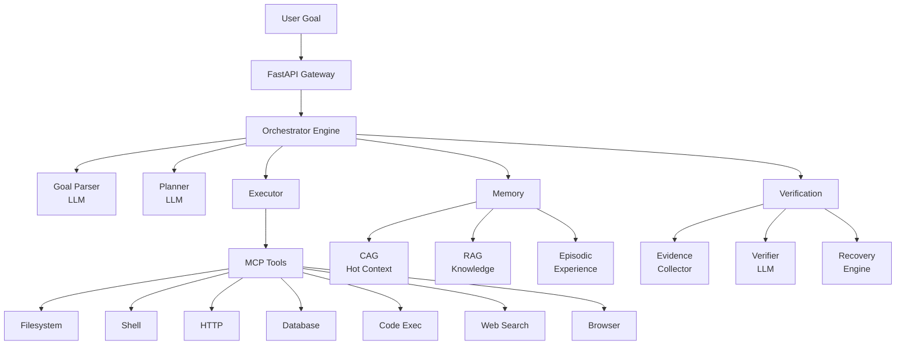

<div align="center">

# 🧠 agent-nexus

**A self-healing AI agent framework that plans, executes tools, verifies outcomes, and recovers from failures — designed end-to-end for free-tier deployment.**

[](https://www.python.org/downloads/)
[](LICENSE)
[](https://fastapi.tiangolo.com)
[](Dockerfile)
[](.github/workflows/ci.yml)

[Quick Start](#-quick-start) · [Architecture](#-architecture) · [Features](#-features) · [Design Trade-offs](#%EF%B8%8F-design-trade-offs) · [API](#-api-reference) · [Deployment](#-deployment) · [Contact](#-contact)

<!-- CONTACT_EMAIL_START -->
**Contact:** [vaibhavgoyal693@gmail.com](mailto:vaibhavgoyal693@gmail.com) · GitHub: [@vaibhav-4-ai](https://github.com/vaibhav-4-ai)
<!-- CONTACT_EMAIL_END -->

</div>

---

## What this is (and isn't)

agent-nexus is a goal-driven AI agent: you give it a natural-language objective, it autonomously plans steps, picks tools (filesystem, shell, HTTP, web search, code execution, SQL, headless browser), executes them with evidence-based verification, and recovers automatically from common failure modes (LLM rate limits, container restarts, quota exhaustion, transient tool errors).

**Built for:** personal portfolio demos, single-user/small-team self-hosting, a substrate to learn how autonomous agents are structured end-to-end. The entire stack is engineered to run on **$0 free-tier services with no credit card on file**.

**Not built for:** multi-tenant SaaS, high-concurrency production, regulated workloads. There's no per-user accounting, no horizontal scaling, and no SLA. If you need those, this is a starting point, not a destination.

---

## What makes it interesting

These are the design decisions that are non-obvious if you've used LangChain / AutoGPT and that recruiters / collaborators tend to ask about:

- **LLM-agnostic via LiteLLM.** Default `groq/llama-3.3-70b-versatile` (free, no card). Swap to `openai/gpt-4o-mini`, `anthropic/claude-3-5-haiku-latest`, `gemini/gemini-1.5-flash`, or a self-hosted Ollama model with a single env-var change — no code change. Verified by inspection of [`src/llm/provider.py`](src/llm/provider.py).
- **Per-task BYOK in the frontend.** Visitors paste their own provider key into the UI's *Inference settings* panel; the key is scoped to that single request, never written to logs or disk. See [`frontend/index.html:65-112`](frontend/index.html#L65-L112).
- **Automatic LLM failover on rate-limit.** When the primary model hits its daily token budget, the provider transparently swaps to the configured fallback model for the rest of the process lifetime — without restart, without user action. See [`src/llm/provider.py:223-275`](src/llm/provider.py#L223-L275) (event name: `llm_rate_limit_failover`).
- **Restart-safe task lifecycle.** Tasks persist to Postgres at every state transition. If the container restarts mid-execution, polling the task returns `status=failed, error="server restarted before task completed"` instead of vanishing as a 404. Validated by T19 in the smoke test.
- **Defense-in-depth at the tool layer**, not the auth layer. The HTTP endpoints are intentionally open (it's a public demo); abuse is bounded inside the MCP servers themselves: SSRF filter blocks RFC1918 / cloud metadata / loopback ([`http_server.py`](src/mcp/servers/http_server.py)); shell injection blocker rejects `$()`, backticks, pipes, redirects ([`shell_server.py`](src/mcp/servers/shell_server.py)); database queries are hardcoded `SELECT`-only ([`database_server.py`](src/mcp/servers/database_server.py)); code-exec subprocess gets a curated env so API keys are never visible to user code ([`code_exec_server.py`](src/mcp/servers/code_exec_server.py)).
- **Auto-eviction at 80% of any free-tier quota** — no human ever has to clean up. QuotaManager runs hourly, evicts oldest 30% of episodic memories from Qdrant or oldest knowledge-graph rows when usage crosses the threshold. See [`src/infra/alerts.py`](src/infra/alerts.py).
- **Logging hygiene.** A regex-based redaction pass runs as a structlog processor on every log line — Groq / OpenAI / Anthropic / GitHub / Google key patterns get replaced with `<REDACTED>` before output. Plus per-site truncation at the call sites where LLM exception text could embed a URL with a key.

---

## 🚀 Quick Start

### Option 1 — Docker (recommended)
```bash
git clone https://github.com/vaibhav-4-ai/agent-nexus.git
cd agent-nexus
cp .env.example .env
# Edit .env — at minimum set GROQ_API_KEY (free at https://console.groq.com)
docker compose up -d
open http://localhost:7860         # frontend UI
```

### Option 2 — Verify the deployment works end-to-end
```bash
pip install websockets             # one-time, lets WebSocket test run
python tests/production_smoke.py --pace 12
# Expect ~23 PASS / 0 FAIL / 5 SKIP. The 5 SKIPs are intentional —
# see DEPLOYMENT.md "Reading the smoke output".
```

### Option 3 — Full free-tier deploy to Hugging Face Spaces
See [**DEPLOYMENT.md**](DEPLOYMENT.md) — a single ~30-minute walkthrough that takes you from signups (Neon, Qdrant Cloud, Upstash, Groq, DagsHub) through git push to a live HF Space.

---

## 🏗️ Architecture



### Execution loop
```
Parse Goal → Create Plan → For Each Step:
  ┌─→ Select Tool → Execute → Collect Evidence → Verify
  │   ✅ Pass (confidence > 0.8) → Next Step
  │   🔄 Retry (0.5 < confidence < 0.8) → Modify & Retry
  └── ⏪ Rollback (confidence < 0.5) → Re-plan Step
      🆘 Escalate (3 failures) → Ask User
```

---

## ✨ Features

Every row below is verified against the actual codebase. Items that are designed but not actively exercised in the default agent flow are marked 📋.

| Category | Feature | Status | Notes |
|---|---|---|---|
| **Core** | Autonomous task execution (plan → tool → verify → recover) | ✅ | |
| | Real-time WebSocket streaming of step updates | ✅ | Polling-based (500ms granularity) — see Design Trade-offs |
| | Human-in-the-loop feedback endpoint | ✅ | Currently a logging stub; useful as an extension point |
| **LLM** | LiteLLM provider abstraction (Groq / OpenAI / Anthropic / Gemini / Ollama / vLLM / HF) | ✅ | |
| | Per-task BYOK from the UI (`Inference settings` panel) | ✅ | Key scoped to one request; never persisted server-side |
| | Automatic rate-limit failover to fallback model | ✅ | Logs `llm_rate_limit_failover` when it fires |
| **Tools (MCP)** | Filesystem read / write / search | ✅ | |
| | Shell command execution (with injection guards) | ✅ | Rejects `$()`, backticks, pipes, redirects |
| | HTTP requests (with SSRF filter) | ✅ | Blocks RFC1918, loopback, metadata endpoints |
| | Database queries (PostgreSQL, SELECT-only) | ✅ | Hardcoded — not LLM-controllable |
| | Python/JS code execution (env-scrubbed subprocess) | ✅ | API keys / DB URLs stripped from view of user code |
| | Web search (DuckDuckGo default, Tavily optional) | ✅ | DuckDuckGo can return inconsistent results — see Trade-offs |
| | Browser automation (Playwright) | 📋 | Opt-in via `MCP_BROWSER_ENABLED=true` (~400MB RAM) |
| **Memory** | CAG sliding context window (token-aware) | ✅ | |
| | RAG over Qdrant Cloud (vector similarity) | ✅ | |
| | Episodic memory (past task vectors with LRU eviction) | ✅ | |
| | In-process knowledge graph | 📋 | Entities recorded during execution; not yet used for downstream retrieval |
| **Verification** | Post-action evidence collection | ✅ | |
| | LLM-based outcome verification | ✅ | |
| | Auto-retry with modifications | ✅ | |
| | Rollback + re-planning on persistent failure | ✅ | |
| **Perception** | Vision via vision-capable LLM (`complete_with_vision`) | ✅ | Routes to `LLM_VISION_MODEL` |
| | Document parsing (PDF / DOCX) | 📋 | Module present; not wired into the default agent flow |
| | Audio transcription | 📋 | Module present; not wired into the default agent flow |
| | Code AST analysis (tree-sitter) | 📋 | Module present; not wired into the default agent flow |
| **Resilience** | Restart-safe task lifecycle (DB persistence + recovery) | ✅ | T19 in smoke test validates end-to-end |
| | 24h auto-cleanup of in-memory task store + Postgres rows | ✅ | Hourly background task |
| | Auto-eviction at 80% of Qdrant / knowledge_graph free tier | ✅ | No human action required |
| | Redis circuit breaker with in-memory fallback | ✅ | |
| **Observability** | Structured JSON logging (structlog) | ✅ | |
| | Global secret-redaction processor on every log line | ✅ | Groq/OpenAI/Anthropic/GitHub/Google key patterns |
| | MLflow metrics → DagsHub (optional) | ✅ | One env var enables it |
| | Webhook alerts to ntfy/Discord/Slack on quota thresholds | ✅ | Optional |
| **Deployment** | Docker Compose for local dev (Postgres + Qdrant + app) | ✅ | |
| | Single-file Dockerfile for HF Spaces | ✅ | |
| | GitHub Actions CI (lint + type-check + tests) | ✅ | [.github/workflows/ci.yml](.github/workflows/ci.yml) |
| | End-to-end smoke test suite (25 sections) | ✅ | [tests/production_smoke.py](tests/production_smoke.py) |

---

## ⚖️ Design Trade-offs

The decisions you'll notice when reading the code, and why they're the way they are:

- **Endpoints are open (no API key by default).** Intentional, for public demo: a visiting recruiter can submit a task without signing up. Abuse is bounded by tool-layer guards (SSRF, shell injection, SELECT-only DB, code-exec env scrub) plus the global concurrency cap of 3 simultaneous tasks. To lock down, add `dependencies=[Depends(require_api_key)]` to any route — the dependency is already defined and imported.
- **WebSocket streaming is polling-based** (~500ms granularity) rather than event-driven. Fine for a free-CPU container; would need a real pub/sub layer for high-throughput.
- **Concurrency is capped at 3 tasks server-wide.** A `asyncio.Semaphore(3)` — appropriate for free-tier LLM rate limits, not for production scale.
- **JSON-mode is deliberately *not* enabled** in the LiteLLM call path. Groq's strict server-side JSON validator rejects loose-but-parseable output (e.g. plans with embedded Python code). We rely on `structured_output.extract_json()` + Pydantic validation with retry instead. See [`provider.py`](src/llm/provider.py) note in `complete()`.
- **No retry on tasks that fail LLM rate-limits past the per-minute window.** Tenacity does short-retry on `ServiceUnavailableError`; rate-limit errors instead trigger the failover model swap. If both models hit their TPD, the task fails gracefully (no crash). Quotas reset over a rolling 24h window.
- **Local Qdrant container in `docker-compose.yml`** is for development only. Production points at Qdrant Cloud's free 1 GB tier via `VECTOR_URL` + `VECTOR_API_KEY`.
- **In-memory knowledge graph is per-process.** Resets on restart (intentional — it's just a working surface during a task; durable knowledge lives in episodic memory in Qdrant).

---

## 🔑 Configuration

Three LLM paths — pick whichever fits.

### Path 1 — Default (Groq, free, no card)
```bash
echo "GROQ_API_KEY=gsk_..." >> .env   # get one at console.groq.com
docker compose up -d
```

### Path 2 — Bring Your Own Key
Either in the UI (visitor-side, no `.env` edit needed) or globally via `.env`:
```bash
# Gemini
echo "GEMINI_API_KEY=AIza..."     >> .env
echo "LLM_MODEL=gemini/gemini-1.5-flash" >> .env

# OpenAI
echo "OPENAI_API_KEY=sk-..."       >> .env
echo "LLM_MODEL=openai/gpt-4o-mini" >> .env

# Anthropic
echo "ANTHROPIC_API_KEY=sk-ant-..." >> .env
echo "LLM_MODEL=anthropic/claude-3-5-haiku-latest" >> .env
```

### Path 3 — Fully self-hosted
```bash
docker compose --profile local up -d   # first run pulls ~2GB Ollama model
```

### Free-tier services (none require a credit card)

| Service | Provider | Free tier |
|---|---|---|
| LLM | Groq (default) / Gemini / OpenAI / Anthropic / Ollama | varies; Groq gives 100K + 500K TPD across two models |
| Database | Neon.tech | 0.5 GB Postgres (auto-pruned to 3-day retention) |
| Vector DB | Qdrant Cloud | 1 GB cluster (auto-evicted at 80% threshold) |
| Cache | Upstash Redis | 500K commands/month (in-memory fallback if unavailable) |
| Monitoring | DagsHub MLflow | Unlimited for public projects |
| Search | DuckDuckGo | Unlimited (rate-limited under load) |
| Alerts | ntfy.sh | Free push notifications (no signup) |
| Hosting | Hugging Face Spaces (Docker, CPU basic) | 16 GB RAM, sleeps when idle |

### Operational guarantees
- **24h auto-cleanup** of in-memory task results + Postgres rows (`tasks`, `task_steps`, `event_log`, `agent_metrics`)
- **Auto-eviction** of oldest 30% of Qdrant episodic vectors / `knowledge_graph` rows at 80% of free-tier capacity
- **Restart-safe**: in-flight tasks marked failed with a clear message instead of vanishing
- **Failover-ready**: primary model exhaustion automatically falls back to the configured `LLM_FALLBACK_MODEL`
- **Optional webhook** for informational notifications: set `ALERT_WEBHOOK_URL=https://ntfy.sh/your-topic` in `.env`

See [.env.example](.env.example) for the full configuration surface.

---

## 📚 API Reference

| Method | Endpoint | Description |
|---|---|---|
| `POST` | `/api/v1/tasks` | Create a new task |
| `GET` | `/api/v1/tasks/{id}` | Get task status (falls back to DB if evicted from memory) |
| `WS` | `/api/v1/tasks/{id}/stream` | Real-time updates |
| `GET` | `/api/v1/tasks/{id}/evidence` | Evidence chain |
| `POST` | `/api/v1/tasks/{id}/feedback` | Human feedback (stub) |
| `GET` | `/api/v1/mcp/servers` | List MCP tools |
| `GET` | `/api/v1/health` | Health check (includes per-component status) |
| `GET` | `/api/v1/metrics` | Live metrics dashboard data |

Interactive docs at [http://localhost:7860/docs](http://localhost:7860/docs) (Swagger UI) when running.

---

## 🚢 Deployment

For a step-by-step walkthrough — signups for each free service, local Docker smoke, HF Spaces git workflow, secret management, post-deploy verification — see **[DEPLOYMENT.md](DEPLOYMENT.md)**.

It includes an explicit "what you need to do" checklist, the connection model for DagsHub + ntfy, and a guide to reading the smoke-test output.

---

## 📁 Project Structure

```
agent-nexus/
├── src/
│   ├── main.py                # FastAPI entry point + lifespan hooks
│   ├── config.py              # Pydantic Settings (all env-var-driven)
│   ├── api/                   # Routes, schemas, middleware (auth, CORS, logging)
│   ├── orchestrator/          # Goal parser, planner, executor, engine, state
│   ├── memory/                # CAG, RAG, Episodic, Graph, Router
│   ├── perception/            # VLM, Audio, Code, Document, Metrics modules
│   ├── mcp/                   # Protocol, client, 7 built-in servers
│   ├── verification/          # Verifier, evidence, claims, recovery
│   ├── llm/                   # Provider (LiteLLM), prompts, structured output
│   └── infra/                 # DB, Redis, Vector, Events, Metrics, Logging, Alerts
├── tests/
│   ├── production_smoke.py    # End-to-end smoke (25 sections, --pace, --dual-model)
│   ├── unit/ integration/ e2e/  # Pytest suites
├── docs/                      # Architecture, API, memory, verification
├── frontend/                  # Static HTML/CSS/JS UI with BYOK panel
├── scripts/sync_contact.py    # Propagates pyproject email into README + frontend
├── docker-compose.yml         # Local stack (app + postgres + qdrant)
├── Dockerfile                 # Single-image production build (HF Spaces target)
├── DEPLOYMENT.md              # End-to-end deployment guide
└── SETUP_GUIDE.md             # Legacy setup notes (kept for reference)
```

---

## 🤝 Contributing

1. Fork the repository
2. Create a feature branch: `git checkout -b feature/your-feature`
3. Install dev deps: `pip install -e ".[dev]"`
4. Run tests: `pytest tests/` (unit + integration) or `python tests/production_smoke.py --pace 12` (end-to-end smoke)
5. Submit a pull request — CI runs ruff + mypy + pytest on every push

---

## 📄 License

Apache License 2.0 — see [LICENSE](LICENSE).
