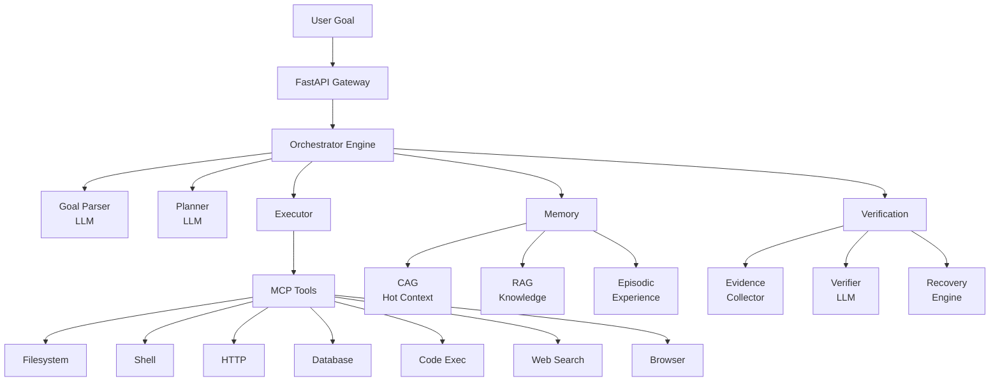

<div align="center">

# 🧠 agent-nexus

**Multimodal AI Agent that sees, hears, reads code, queries databases, and reasons across all modalities — with self-healing and grounded verification.**

[](https://www.python.org/downloads/)
[](LICENSE)
[](https://fastapi.tiangolo.com)
[](Dockerfile)
[](.github/workflows/ci.yml)

[Quick Start](#-quick-start) · [Architecture](#-architecture) · [Features](#-features) · [API Docs](#-api-reference) · [Contributing](#-contributing)

</div>

---

## 🤔 Why agent-nexus?

| Feature | agent-nexus | LangChain Agents | AutoGPT |
|---------|:-----------:|:----------------:|:-------:|
| **Built from scratch** (no framework lock-in) | ✅ | ❌ | ❌ |
| **Self-healing verification** after every action | ✅ | ❌ | ❌ |
| **MCP protocol** for standardized tool integration | ✅ | ❌ | ❌ |
| **Hybrid memory** (CAG + RAG + Episodic) | ✅ | Partial | Partial |
| **Multimodal perception** (vision, audio, code, docs) | ✅ | ❌ | ❌ |
| **100% free deployment** (no credit card) | ✅ | ❌ | ❌ |
| **Evidence-grounded reasoning** | ✅ | ❌ | ❌ |

---

## 🎯 Core Agentic Capabilities

agent-nexus is engineered for **secure, deterministic automation** in production environments. Rather than relying on fragile open-web scraping, it focuses on high-reliability, zero-hallucination data processing.

### 📊 Autonomous Data Science
* The agent autonomously reads datasets, writes native Python scripts to process the data, executes them in a sandboxed environment, and generates analytical reports.

### 🔍 SQL Data Mining
* Seamlessly connects to PostgreSQL databases. The agent plans, writes, and executes complex `SELECT` queries to analyze system metrics without human intervention.

### ⚙️ Codebase Operations & Refactoring
* Capable of traversing local repositories, performing code analysis, writing auto-generated documentation, and applying bug fixes directly to the filesystem.

### 🛡️ Enterprise-Grade Guardrails
* **Sandboxed Database Execution:** Built-in SQL interceptors actively block destructive DML/DDL commands (`DROP`, `TRUNCATE`, `CREATE`) to protect production data from LLM hallucinations.
* **Deterministic API Consumption:** Prioritizes structured REST endpoints over raw HTML scraping, guaranteeing 100% execution reliability and bypassing brittle bot-protection mechanisms.
* **Automated Data Lifecycle Management:** Includes an asynchronous background engine that automatically garbage-collects stale execution traces and logs, ensuring zero-maintenance deployments and protecting free-tier storage limits.
* **Asynchronous Task Queueing:** Features a native `asyncio` scheduling engine that gracefully handles high-concurrency traffic bursts, seamlessly queueing tasks to optimize compute allocation and strictly adhere to LLM API rate limits.

---

## 🚀 Quick Start

### Option 1: Docker (Local Development)
```bash
# Clone the repository
git clone https://github.com/vaibhav-4-ai/agent-nexus.git
cd agent-nexus

# Copy and configure environment
cp .env.example .env
# Edit .env — at minimum set GROQ_API_KEY (free at https://console.groq.com)

# Start all services
docker compose up -d

# Send your first task
curl -X POST http://localhost:7860/api/v1/tasks \
  -H "Content-Type: application/json" \
  -d '{"goal": "List all files in the workspace and summarize them"}'
```

### Option 2: Python (Without Docker)
```bash
pip install -e .
cp .env.example .env
# Edit .env with your API keys
python -m src.main
```

### Option 3: Hugging Face Spaces (Free Cloud Deployment)
See [SETUP_GUIDE.md](SETUP_GUIDE.md) for detailed deployment instructions.

---

## 🏗️ Architecture



### Execution Loop
```
Parse Goal → Create Plan → For Each Step:
  ┌─→ Select Tool → Execute → Collect Evidence → Verify
  │   ✅ Pass (confidence > 0.8) → Next Step
  │   🔄 Retry (0.5 < confidence < 0.8) → Modify & Retry
  └── ⏪ Rollback (confidence < 0.5) → Re-plan Step
      🆘 Escalate (3 failures) → Ask User
```

---

## ✨ Features

| Category | Feature | Status |
|----------|---------|--------|
| **Core** | Autonomous task execution | ✅ |
| | Step-by-step planning with LLM | ✅ |
| | Real-time WebSocket streaming | ✅ |
| | Human-in-the-loop feedback | ✅ |
| **Tools (MCP)** | File read/write/search | ✅ |
| | Shell command execution | ✅ |
| | HTTP requests | ✅ |
| | Database queries (PostgreSQL) | ✅ |
| | Python/JS code execution | ✅ |
| | Web search (Tavily/DuckDuckGo) | ✅ |
| | Browser automation (Playwright) | ✅ |
| **Memory** | CAG (sliding context window) | ✅ |
| | RAG (vector similarity search) | ✅ |
| | Episodic (past task memory) | ✅ |
| | Knowledge graph | ✅ |
| **Verification** | Post-action evidence collection | ✅ |
| | LLM-based verification | ✅ |
| | Auto-retry with modifications | ✅ |
| | Rollback and re-planning | ✅ |
| **Perception** | Vision (image understanding) | ✅ |
| | Audio (speech-to-text) | ✅ |
| | Code analysis (AST parsing) | ✅ |
| | Document parsing (PDF/DOCX) | ✅ |
| **Infra** | Async everything (asyncio) | ✅ |
| | Structured JSON logging | ✅ |
| | MLflow metrics tracking | ✅ |
| | Docker + Docker Compose | ✅ |
| | CI/CD (GitHub Actions) | ✅ |

---

## 🔑 Configuration

The system works with **one environment variable**: `GROQ_API_KEY` (free at [console.groq.com](https://console.groq.com)).

All services use free tiers:

| Service | Provider | Free Tier |
|---------|----------|-----------|
| LLM | Groq | 30 req/min, Llama-3.3-70B |
| Database | Neon.tech | 0.5GB Postgres |
| Vector DB | Qdrant Cloud | 1GB cluster |
| Cache | Upstash | 500K cmd/month |
| Monitoring | DagsHub | Unlimited MLflow |
| Search | DuckDuckGo | Unlimited |

See [.env.example](.env.example) for all configuration options.

---

## 📚 API Reference

| Method | Endpoint | Description |
|--------|----------|-------------|
| `POST` | `/api/v1/tasks` | Create a new task |
| `GET` | `/api/v1/tasks/{id}` | Get task status |
| `WS` | `/api/v1/tasks/{id}/stream` | Real-time updates |
| `GET` | `/api/v1/tasks/{id}/evidence` | Evidence chain |
| `POST` | `/api/v1/tasks/{id}/feedback` | Human feedback |
| `GET` | `/api/v1/mcp/servers` | List MCP tools |
| `GET` | `/api/v1/health` | Health check |
| `GET` | `/api/v1/metrics` | Metrics dashboard |

Full docs at [/docs](http://localhost:7860/docs) (Swagger UI) when running.

---

## 📁 Project Structure

```
agent-nexus/
├── src/
│   ├── main.py              # FastAPI entry point
│   ├── config.py             # Pydantic Settings
│   ├── api/                  # Routes, schemas, middleware
│   ├── orchestrator/         # Goal parser, planner, executor, engine
│   ├── memory/               # CAG, RAG, Episodic, Graph, Router
│   ├── perception/           # VLM, Audio, Code, Document, Metrics
│   ├── mcp/                  # Protocol, client, 7 built-in servers
│   ├── verification/         # Verifier, evidence, claims, recovery
│   ├── llm/                  # Provider, prompts, structured output
│   └── infra/                # DB, Redis, Vector, Events, Metrics, Logging
├── tests/                    # Unit, integration, and E2E tests
├── docs/                     # Architecture, API, guides
├── examples/                 # Working example scripts
├── monitoring/               # MLflow setup, dashboard
├── configs/                  # YAML config files
├── docker-compose.yml        # Local development stack
├── Dockerfile                # Production image
└── SETUP_GUIDE.md            # Step-by-step deployment guide
```

---

## 🤝 Contributing

1. Fork the repository
2. Create a feature branch: `git checkout -b feature/amazing-feature`
3. Install dev dependencies: `pip install -e ".[dev]"`
4. Make your changes and run tests: `make test`
5. Submit a pull request

---

## 📄 License

This project is licensed under the Apache License 2.0 — see [LICENSE](LICENSE) for details.

---

<div align="center">
<b>Built with ❤️ — No frameworks, no shortcuts, just engineering.</b>
</div>
