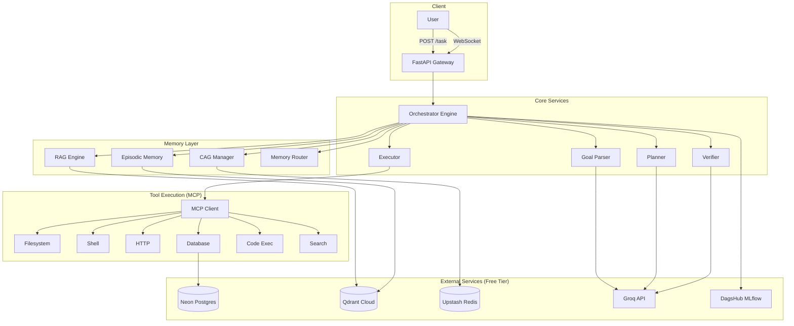

# Architecture

## System Overview

## Data Flow

1. **User submits a task** via REST API or WebSocket
2. **Goal Parser** decomposes the natural language goal into structured objectives
3. **Memory Router** queries CAG, RAG, and Episodic memory for relevant context
4. **Planner** creates a step-by-step execution plan informed by past experience
5. **Executor** selects and invokes MCP tools for each step
6. **Evidence Collector** gathers multimodal evidence after each action
7. **Verifier** evaluates success using LLM reasoning on the evidence
8. **Recovery Engine** handles failures via retry, rollback, or re-planning
9. **Results** are streamed back via WebSocket and stored in the database

## Design Patterns

| Pattern | Component | Purpose |
|---------|-----------|---------|
| Strategy | LLM Provider | Swap backends without code changes |
| Factory | Perception Layer | Create modality-specific engines |
| Repository | Database Layer | Abstract DB operations |
| State Machine | Task Lifecycle | Enforce valid state transitions |
| Circuit Breaker | LLM/Redis clients | Prevent cascading failures |
| Observer | Event Bus | Decouple event producers/consumers |
| Template Method | MCP Servers | Shared lifecycle management |
| Chain of Responsibility | Memory Router | Priority-based memory querying |
